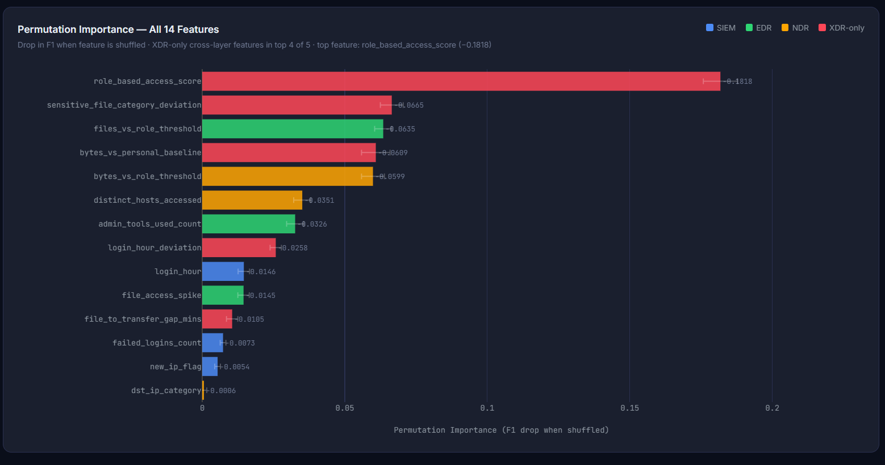
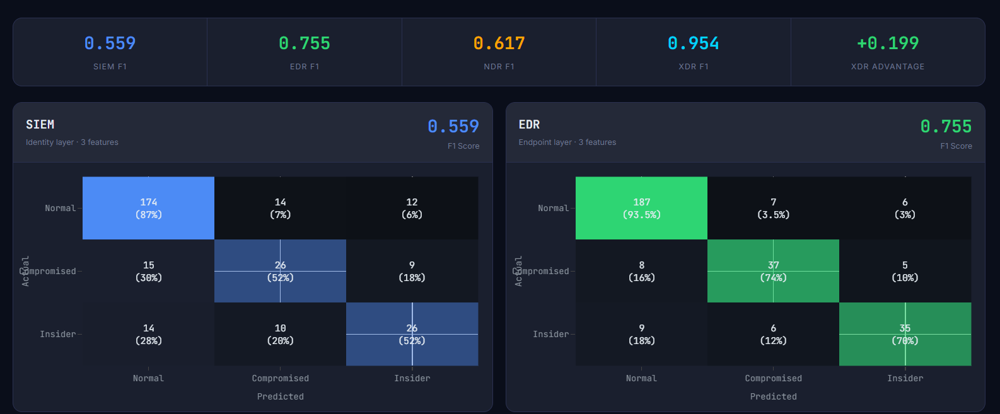
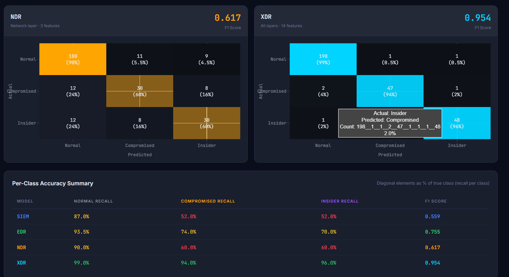
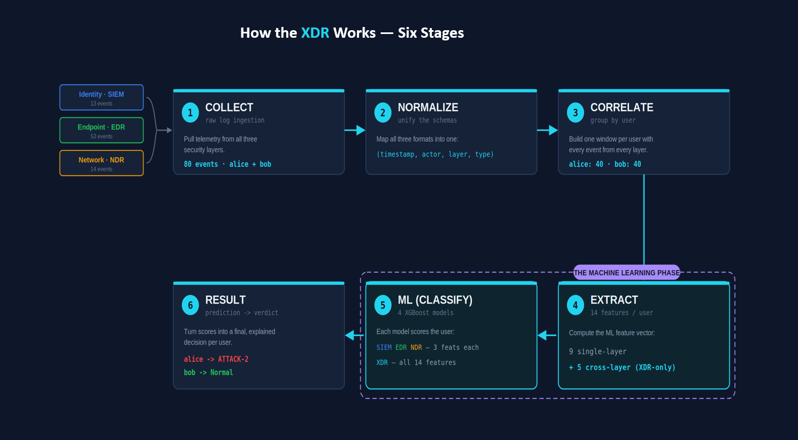
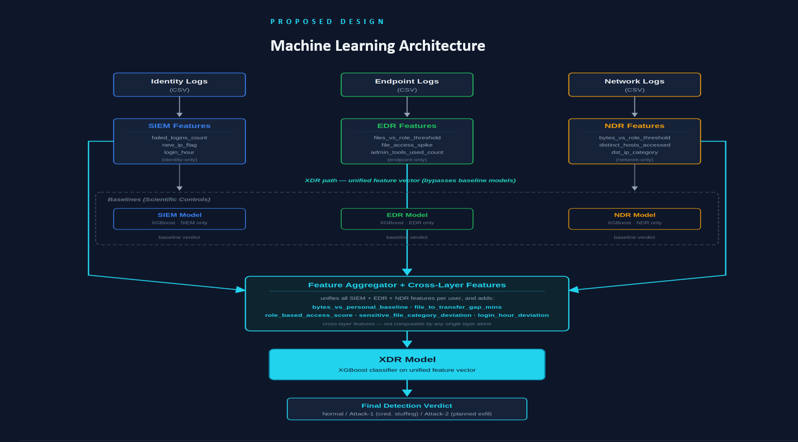
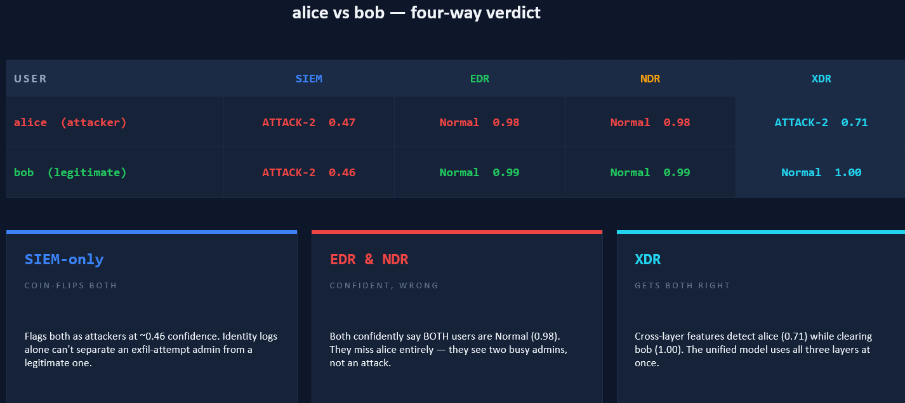
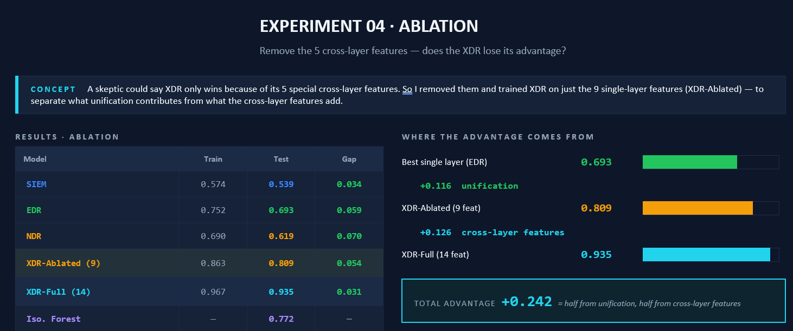
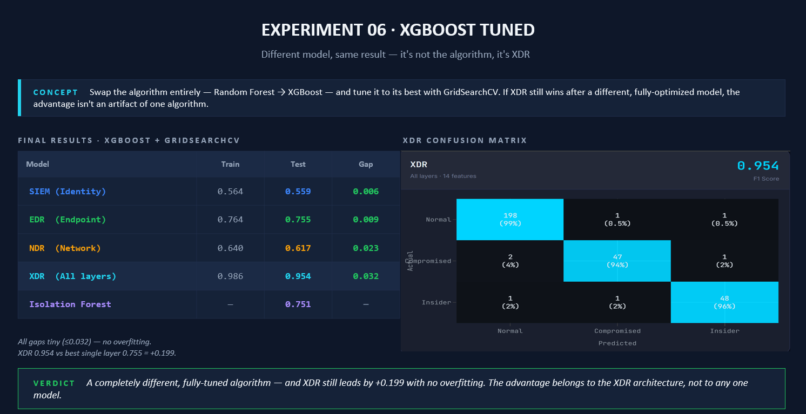
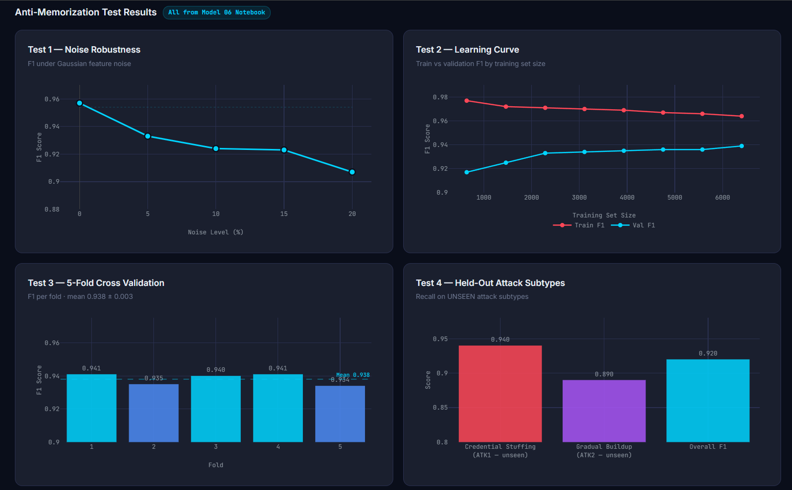

# AI-Enhanced XDR: Insider Threat & Compromised Account Detection

An Extended Detection and Response (XDR) system that demonstrates why cross-layer security correlation outperforms traditional single-layer monitoring tools (SIEM, EDR, NDR) when detecting insider threats and compromised accounts.

## The Problem

Modern attackers don't stay in one place. A compromised account might show up first as a suspicious login (identity layer), then unusual file access (endpoint layer), then anomalous outbound traffic (network layer). Traditional security tools — SIEM, EDR, NDR — each watch one of these layers in isolation. An attacker who moves carefully across layers can stay under each individual tool's detection threshold while the full picture, visible only when the layers are correlated together, is unmistakably malicious.

This project builds and evaluates an XDR system that unifies these layers into a single feature space and shows, with hard numbers, exactly how much detection performance that unification buys you.

## Key Results

| Metric | Single-layer baseline (best: EDR) | Unified XDR model |
|---|---|---|
| F1 Score | 0.755 | **0.954** |
| Improvement | — | **+0.199** |

**Where the improvement comes from (ablation study):**
- Feature unification alone: **+0.116 F1**
- Cross-layer derived features (engineered from combinations across layers): **+0.126 F1**

These two effects compound — the gain isn't just "more features," it's specifically that correlating signal *across* layers surfaces patterns invisible to any single layer.

**Model robustness:**
- 5-fold cross-validation: **0.938 ± 0.003** F1 (tight variance, not a lucky split)
- Held-out recall: **0.940 / 0.890** across evaluation sets

**Most important feature (by permutation importance):**
- `role_based_access_score` — **0.1818** — a derived feature measuring whether a user's behavior is consistent with their assigned role, which is itself a clear example of a cross-layer signal: it only exists because identity, access, and behavioral data were unified.



Note how the top features by importance are overwhelmingly XDR-only cross-layer features (red) — 4 of the top 5. This is direct evidence that the model's advantage comes from the cross-layer signal itself, not just having more data.

**Final model:** XGBoost, selected after comparison against baseline and tuned Random Forest approaches.




Each single-layer model struggles especially on the harder classes (Compromised, Insider) — SIEM and NDR both sit around 52–60% recall there. The XDR model, using all 14 features, reaches 94–96% recall on those same hard classes while staying at 99% on Normal.

## Architecture

### How the system works — six stages



1. **Collect** — pull raw telemetry from all three security layers (Identity/SIEM, Endpoint/EDR, Network/NDR)
2. **Normalize** — map all log formats into one unified schema (`timestamp`, `actor`, `layer`, `type`)
3. **Correlate** — group every event, across all layers, into one window per user
4. **Extract** — compute the ML feature vector per user: 9 single-layer features + 5 cross-layer features (XDR-only)
5. **ML (Classify)** — score the user with 4 XGBoost models: separate SIEM/EDR/NDR baseline models (3 features each) and the XDR model (all 14 features)
6. **Result** — turn model scores into a final, explained verdict per user (e.g. Normal vs. Attack-1 / Attack-2)

### Machine learning architecture



Identity, endpoint, and network logs are each converted into layer-specific features (e.g. `failed_logins_count`, `file_access_spike`, `bytes_vs_role_threshold`). These feed two parallel paths:

- **Baseline path** (scientific controls): each layer's features alone train a single-layer model (SIEM-only, EDR-only, NDR-only) — this is what produces the 0.755 best single-layer F1 used as the comparison point.
- **XDR path**: all layer features are unified by the **Feature Aggregator**, which also computes cross-layer features that no single layer can compute alone — `bytes_vs_personal_baseline`, `file_to_transfer_gap_mins`, `role_based_access_score`, `sensitive_file_category_deviation`, `login_hour_deviation`. This unified vector trains the XDR model, which produces the final detection verdict.

This is the architectural reason the XDR model outperforms any single-layer baseline: it isn't using better data, it's using features that are structurally impossible to compute without correlating layers together.

The system is built and evaluated in two parts:

1. **Model development & evaluation** (`model_01` → `model_06` notebooks): baseline single-layer models, dataset scaling experiments, ablation study isolating where the performance gain comes from, hyperparameter tuning, and the final XGBoost model.
2. **Pipeline demo** (`pipeline_demo/`): an end-to-end simulation that runs realistic attack scenarios through the trained models and produces correlated detections — proof that the system works on data flowing through it like a real pipeline, not just in a notebook.

## Repository Structure

```
.
├── main.py                      # Core pipeline entry point
├── ml_model.py                  # Model training/inference logic
├── xdr_dataset.py               # Dataset construction utilities
├── feature_extractor.py         # Feature engineering across layers
├── feature_analysis.py          # Feature importance / analysis tooling
├── config.py                    # Project configuration
│
├── model_01_baseline.ipynb      # Single-layer baseline models
├── model_02_bigger_dataset_3x.ipynb
├── model_03_bigger_dataset_8x.ipynb
├── model_04_ablation.ipynb      # Ablation study (where the F1 gain comes from)
├── model_05_tuned_rf.ipynb      # Tuned Random Forest comparison
├── model_06_xgboost.ipynb       # Final XGBoost model + results
│
├── modules/                     # Detection logic per security layer
│   ├── identity_detector.py
│   ├── endpoint_detector.py
│   ├── network_detector.py
│   ├── anomaly_detector.py
│   ├── attack_comparison.py
│   ├── normalizer.py
│   ├── event_loader.py
│   ├── clean_cert.py
│   └── explore_cert.py
│
├── dashboard/                   # Flask + Plotly SOC dashboard
│   ├── app.py
│   ├── data_loader.py
│   ├── generate_attacker_scores.py
│   ├── templates/                # Overview, features, matrices, methodology,
│   │                              # per-attack-scenario story pages
│   └── static/css/
│
└── pipeline_demo/               # End-to-end attack simulation pipeline
    ├── main.py                   # Runs both attack scenarios automatically
    ├── models/                   # Trained .pkl models (SIEM, EDR, NDR, XDR)
    └── scenarios/
        ├── attack1_credential_stuffing/
        ├── attack1_phishing/
        └── attack2_planned_exfil/
```

## Dataset

This project uses the **CMU CERT Insider Threat Dataset** (industry-standard synthetic dataset for insider threat research), cleaned and unified across identity, endpoint, network, and access logs.

**Note on synthetic data:** the CERT dataset is synthetic by design. This is a deliberate and well-established tradeoff in insider threat research — real-world labeled insider threat data essentially doesn't exist (for obvious privacy and legal reasons), so synthetic datasets with controlled, known ground truth are the field-standard way to build and evaluate these systems. The honest limitation is that synthetic behavior patterns may not capture every nuance of real insider behavior; the benefit is the ability to rigorously measure detection performance against a ground truth that real-world data can't provide.

The largest raw/cleaned dataset files are excluded from this repository due to GitHub's file size limits (see `.gitignore`). Smaller derived datasets used by the pipeline demo are included directly.

## Running the Demo

```bash
# Install dependencies
pip install -r requirements.txt

# Run the pipeline demo
cd pipeline_demo
python main.py
```

`main.py` automatically runs both attack scenarios (credential stuffing and phishing) through the trained models and differentiates between them in the output — you don't need to run them separately.

**What this demo is actually testing:** the scenarios aren't an easy case where the attacker obviously stands out. They're deliberately constructed so that the attacker's behavior closely overlaps with a legitimate user's — similar login patterns, similar access behavior, similar timing. This is the hard, realistic case: a careful attacker trying to blend in.



In this scenario, `alice` is the attacker and `bob` is a legitimate user — and they look nearly identical to single-layer tools. SIEM coin-flips both at ~0.46–0.47 confidence. EDR and NDR are confidently *wrong*, both rating alice and bob as Normal with 0.98–0.99 confidence — they see two busy admins, not an attack. Only XDR, using cross-layer features, correctly catches alice (0.71) while clearing bob (1.00). This is the real test of whether the cross-layer features add genuine discriminative power, not just exploit an obvious difference.

Then launch the SOC dashboard:
```bash
cd dashboard
python app.py
```

The pipeline demo runs real trained XGBoost models (not rule-based shortcuts or hardcoded thresholds) against simulated attack scenario data, producing genuine model inference output. This was a deliberate design choice to keep the demo's results trustworthy rather than cosmetic.

## Methodology Highlights

- **Ablation study as the core evidence**: rather than just claiming "cross-layer features help," the project isolates *how much* each contributing factor (feature unification vs. cross-layer derived features) adds, via controlled ablation — the strongest form of evidence for the project's central thesis.



Removing the 5 cross-layer features (XDR-Ablated) still beats every single-layer model — that's the unification effect (+0.116 F1). Adding the cross-layer features back on top (XDR-Full) adds another +0.126 F1. Together that's the full +0.242 advantage over the best single-layer baseline, decomposed into exactly where it comes from.

- **Algorithm-independence check**: a natural objection is "maybe this only works because of XGBoost." To rule that out, the same comparison was repeated with a separately tuned model via GridSearchCV:



The XDR model still leads by +0.199 F1 with train/test gaps under 0.032 across all models (no overfitting). The advantage holds regardless of which algorithm is used — it belongs to the XDR architecture (the unified feature space), not to one specific model.

- **Dataset scaling experiments** (`model_02`, `model_03`): testing model behavior on 3x and 8x larger synthetic datasets to check that results hold up as data volume increases, not just an artifact of a small sample.
- **Permutation importance** used (rather than only built-in feature importance) for a more reliable measure of which features actually drive predictions.
- **Anti-memorization checks**: beyond standard cross-validation, the model was stress-tested for overfitting and memorization specifically:



This covers noise robustness (F1 degrades gracefully under Gaussian feature noise rather than collapsing), a learning curve showing train/validation F1 converge rather than diverge as training size grows, 5-fold cross-validation holding at 0.938 ± 0.003, and — critically — recall on attack subtypes the model never saw during training (0.940 and 0.890), confirming the model generalizes rather than memorizing the specific attacks it was trained on.

## Tech Stack

- **ML**: Python, scikit-learn, XGBoost, pandas, numpy, joblib
- **Visualization**: matplotlib, seaborn, Plotly
- **Dashboard**: Flask
- **Development**: Jupyter notebooks, VS Code

## Limitations & Honest Caveats

- Trained and evaluated on synthetic data (CERT dataset) — real-world insider threat behavior may differ in ways synthetic data cannot capture.
- The pipeline demo uses a curated set of attack scenarios; it is a proof-of-concept demonstration rather than a production-hardened detection system.
- Class imbalance is inherent to insider threat detection (malicious events are rare by nature) — this is mitigated but not eliminated by the modeling approach used.

## Roadmap

- [x] Add `requirements.txt` for reproducibility
- [x] Add architecture diagrams (`assets/pipeline_six_stages.png`, `assets/ml_architecture.png`)
- [x] Add dashboard screenshots (`assets/screenshots/`)

## Background

This project was developed as a final-year Computer Science graduation project, drawing inspiration from *Redefining Hacking* by Omar Santos on the practical realities of how attackers move across security layers in real environments.

## License

This project is licensed under the MIT License — see the [LICENSE](LICENSE) file for details.
